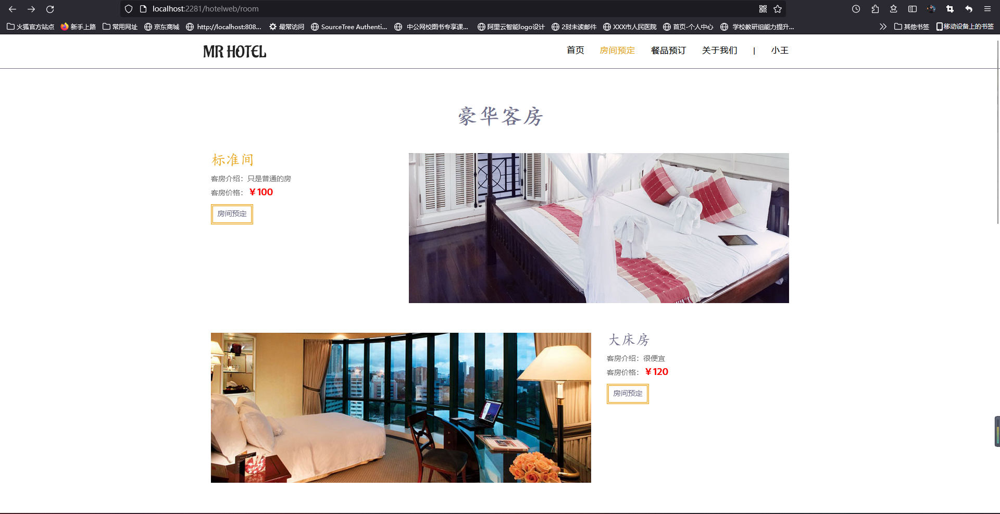

# 基于SSM的多功能酒店系统

#### 介绍

​	现今社会，随着经济的不断发展，人们对物质生活的需求越来越高，尤其是住宿方面的要求也越来越高，那么酒店经营是酒店管理中非常重要的部分，作为旅店工作人员能够通过一个系统对客人入住，房间价格，餐品预订，收支管理等有一个具体的了解也是相当重要的，还能够通过这些信息发现旅店管理的一些问题。基于如此多的优点和作用，本课题分析并设计了这个多动能旅店经营系统。

```

SSM框架技术开发的一个多功能旅店经营系统

前台包含：用户登录、注册、会员、积分折扣、预订房间、订餐、住房评价等

后台包括： 客房管理、房间类型管理、订单管理、菜品管理、用户管理、员工管理等12个模块

```

#### 系统技术栈

Spring + SpringMVC + MyBatis + Thymeleaf + Layui +  jQuery + JavaScript +  MySQL 

#### 仓库代码为压缩版

#### 项目非免费开源，适用于毕业设计，需要请加Q：943701114，非诚勿扰


#### 项目截图

##### 管理员端截图

|  |  |
| ---------------------------------------------- | ---------------------------------------------- |
|  |  |


##### 用户端截图

|  |  |
| -------------------------------------------- | -------------------------------------------- |
|  |  |
|  |  |


#### 参与贡献

1.  斗佛

